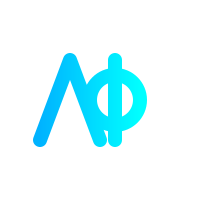
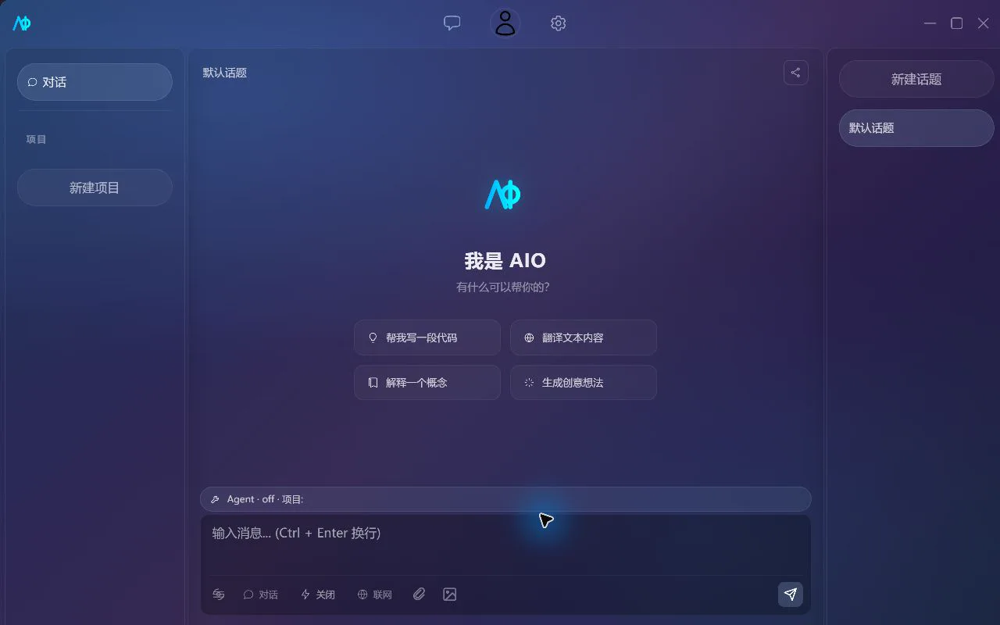

<div align="center">
  
  <h1>AIO (All-In-One AI)</h1>
  <p>
    <strong>A lightweight, cross-platform AI workspace for everyday chat and coding agents.</strong>
  </p>

  <p>
    
    
    
    
  </p>
</div>

**English** | [简体中文](README.zh-CN.md)

---



---

## Core Features

### 1. Multi-Provider Chat

- **Multiple providers**: Google, Anthropic, Ollama, and OpenAI-compatible API.
- **Flexible model management**: Enable models per provider, assign dedicated models for different assistants and sub-agents.
- **Full chat experience**: Streaming output, reasoning content, context compression, auto-titling, and message branching.

### 2. Local LLM Inference

- **llama.cpp powered**: Select and run local GGUF models directly.
- **Auto-install on first use**: When the runtime engine is missing, AIO downloads it automatically on model startup.
- **Unified experience**: Local and remote models share the same assistant, thread, and model selector.

> [!NOTE]
> The vLLM plugin is registered in the Rust backend, but the settings UI currently only exposes llama.cpp. Regular users should use GGUF models.

### 3. Coding Agent

- **Five modes**: Chat, Normal, Auto, Plan, and Workflow — switch freely by task risk level.
- **Project-level tools**: File, Shell, Git, LSP, web search, MCP, and Skills all collaborate within the current directory.
- **Sub-agent collaboration**: Built-in specialist roles for exploration, implementation, architecture, diagnostics, review, documentation, and testing.
- **Security approval**: Dangerous commands, file modifications, and MCP tool calls follow project permission rules.

### 4. Files & Extensions

- **Common file parsing**: Support for images, PDF, DOCX, PPTX, and various text formats.
- **MCP ecosystem**: Supports stdio, HTTP, Streamable HTTP, Catalog, Tools, Resources, and Prompts.
- **Skill management**: Install from the marketplace or import NPX Skills; enable globally or per-project.

### 5. Productivity

- **Quick actions**: Command palette, customizable shortcuts, and slash commands like `/review`, `/fix`, `/btw`.
- **Session sharing**: Export as screenshot, Markdown, JSON, or PDF.
- **Usage statistics**: Token summaries, model distribution, and usage heatmaps.
- **Auto-updates**: Cross-platform updates via GitHub Releases.

---

## Tech Stack

| Layer        | Technology                                   |
| ------------ | -------------------------------------------- |
| Frontend     | SolidJS 1.9, TypeScript, Tailwind CSS, Vite  |
| Desktop      | Tauri 2.11                                   |
| Backend      | Rust, Tokio, Reqwest                         |
| Storage      | SQLite, JSON config, system credential store |
| Local Engine | llama.cpp; vLLM backend plugin               |

---

## Getting Started

### Download Release

Visit [GitHub Releases](https://github.com/Atom112/AIO/releases) and download the package for your system. Releases cover Windows, Ubuntu 22.04, and Intel / Apple Silicon macOS.

After installation, open Settings -> Provider Settings:

1. Configure a remote provider, or select a GGUF model under "Local Inference Engine";
2. Enable the model and return to the chat page;
3. Select a model and start your first conversation.

Want AI to help with code? Create a project, bind a local directory, then switch to Normal, Auto, Plan, or Workflow mode.

### Build from Source

Requires Node.js 20, Rust stable, your platform's [Tauri 2 system dependencies](https://v2.tauri.app/start/prerequisites/), and `aio-models-data` alongside this repository:

```text
parent/
├── AIO/
└── aio-models-data/
```

```bash
git clone https://github.com/Atom112/aio-models-data.git
git clone https://github.com/Atom112/AIO.git
cd AIO
npm ci
npm run tauri dev
```

Pre-build check:

```bash
npm run build
cd src-tauri
cargo check
```

> [!TIP]
> Linux dependencies, release builds, and model directory details are documented in the [development environment guide](docs/en/development/getting-started.md).

---

## Documentation

| What you want to know                               | Start here                                                                |
| --------------------------------------------------- | ------------------------------------------------------------------------- |
| Installation, first-time setup, and your first chat | [Getting Started](docs/en/usage/getting-started.md)                       |
| Providers and local models                          | [Providers and Models](docs/en/usage/providers-and-models.md)             |
| Assistants, projects, agents, and sub-agents        | [Chat and Agent](docs/en/usage/chat-and-agent.md)                         |
| MCP, Skills, and tool permissions                   | [MCP and Skills](docs/en/usage/mcp-and-skills.md)                         |
| Theme, updates, and shortcuts                       | [App Settings and Shortcuts](docs/en/usage/app-settings-and-shortcuts.md) |
| Architecture and extension development              | [Development Guide](docs/en/README.md#development-guide)                  |
| Connection, engine, or build issues                 | [Troubleshooting](docs/en/troubleshooting.md)                             |

For the full index, see the [AIO Documentation Center](docs/en/README.md). For version history, see [CHANGELOG.md](CHANGELOG.md).

---

## Contributing

Found a bug or have an idea? Visit [GitHub Issues](https://github.com/Atom112/AIO/issues):

- When filing a bug, include your OS version, AIO commit, and sanitized error logs;
- Feature requests should describe real-world use cases;
- Before submitting a Pull Request, run `npm run build` and `cargo check`.

---

<div align="center">
  <p>If AIO helps you, a star would mean a lot.</p>
  <p>
    <a href="./LICENSE">Apache-2.0 License</a>
    ·
    <a href="https://github.com/Atom112">Atom112</a>
  </p>
</div>
