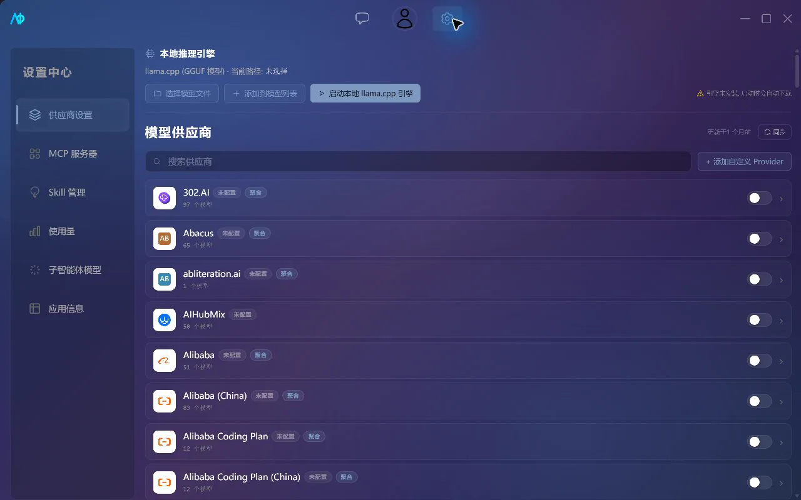

# Getting Started

## Installation

Download the installation package for your platform from [GitHub Releases](https://github.com/Atom112/AIO/releases). The release pipeline builds for the following platforms:

- Windows;
- Ubuntu 22.04;
- Intel macOS;
- Apple Silicon macOS.

The app supports automatic update checking and installation. If the system blocks startup, verify that the installation package came from the project's Releases page.

## Configuring a Remote Model

1. Open "Settings -> Provider Settings".
2. Select a provider from the list, or add a custom OpenAI-compatible provider.
3. Fill in the API URL and API Key.
4. Test the connection, select the models you want to enable, and save.
5. Return to the chat page and select the enabled model from the model picker.

The API Key is preferentially written to the system credential store, not stored in plaintext alongside the normal Provider configuration. See [Providers and Models](providers-and-models.md) for differences between providers.

## Configuring a Local GGUF

1. Open "Settings -> Provider Settings -> Local Inference Engine".
2. Select a `.gguf` file.
3. Click "Add to Model List".
4. Click "Start Local llama.cpp Engine".
5. On first launch, wait for the app to download and install the engine matching your platform.
6. Return to the chat page and select the local model.

The local service runs on `127.0.0.1:8080` by default. Only one local engine process is maintained at a time; it is cleaned up when the app exits.

## Your First Conversation

1. Select a model on the chat page.
2. Use the default chat assistant, or create your own assistant with a custom system prompt.
3. Create a topic and send a message.
4. When document context is needed, upload supported images, PDFs, Office documents, or text files.

Normal chat does not execute project tools. To have the model read or modify code, create a project and select an appropriate Agent mode. See [Chat and Agent](chat-and-agent.md) for details.

## Next Steps

- Learn about providers and the local engine: [Providers and Models](providers-and-models.md)
- Install tool and prompting capabilities for your project: [MCP and Skills](mcp-and-skills.md)
- Customize updates, theme, and shortcuts: [App Settings and Shortcuts](app-settings-and-shortcuts.md)
- Troubleshoot connection or startup errors: [Troubleshooting](../troubleshooting.md)
