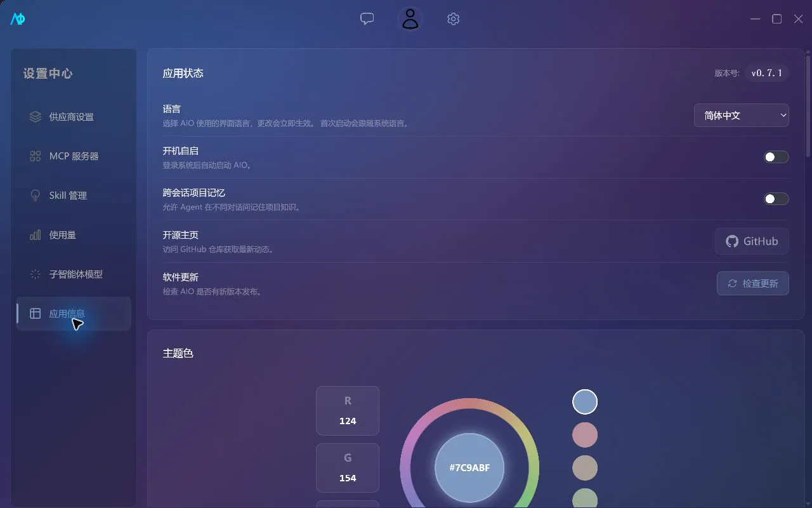

# 应用设置与快捷键

“设置 → 应用设置”集中管理应用状态、视觉主题和快捷键。Provider、MCP、Skill、用量与子智能体模型分别位于设置侧栏的其他页面。



## 界面语言

AIO 支持简体中文（`zh-CN`）和英语（`en-US`）。首次启动会读取系统语言：系统语言以 `zh` 开头时使用简体中文，否则使用英语。你可以在“应用设置 → 语言”中随时切换，已经打开的页面会立即更新，无需重启。

选择结果保存在 WebView `localStorage` 的 `aio-locale` 中，不写入应用配置、SQLite、系统凭据库或项目 `.aio/`。清除此键后，AIO 会在下次启动时重新跟随系统语言。用户消息、模型与 Provider 名称、MCP/Skill 外部描述、文件内容和命令输出始终保留原文。

## 应用状态

### 系统自启

开启“系统自启”后，AIO 会注册当前用户级的开机启动项；关闭开关会移除它。Windows、macOS 和 Linux 使用各自的平台机制，设置失败时界面会恢复原状态。

系统自启与“本地模型自动启动确认”不是同一设置：前者控制 AIO 是否随系统启动，后者只记录用户是否确认过在选择本地模型后启动 llama.cpp 进程。

### 跨会话记忆

开启后，项目 Agent 可以通过 `remember` 和 `recall` 保存、检索架构决策、代码模式、约定与备注。知识保存在项目根目录：

```text
.aio/knowledge.json
```

已有知识会按类别注入后续项目对话。相同 `key` 会更新原条目，当前最多保留 50 条；关闭功能不会删除已有文件。

> [!IMPORTANT]
> `knowledge.json` 属于项目内容，可能包含内部架构或业务信息。提交到版本控制前应先检查。

### 版本更新

“检查更新”会读取 GitHub Releases 的 updater 元数据，并区分以下结果：

- 已是最新版本；
- 发现新版本；
- 当前 Release 未提供更新服务；
- 网络错误；
- 其他检查失败。

发现更新后，应用左下角会展示版本、发布说明和下载入口。正式更新包需要与应用内公钥匹配；本地自行构建的安装包不等同于正式 Release。

## 视觉主题

主题色可以通过色环、饱和度与亮度滑块调整，也可以选择内置预设。颜色立即应用，并保存在 WebView 的 `localStorage` 中；它不会写入项目 `.aio/`。

## 命令面板

按 `Ctrl+K` 打开命令面板，输入名称搜索当前已注册的导航、聊天和侧边栏操作。使用方向键选择，`Enter` 执行，`Esc` 关闭。

macOS 会把快捷键显示为对应的 `⌃`、`⌥`、`⇧`、`⌘` 符号；Windows 和 Linux 使用 `Ctrl`、`Alt`、`Shift`，并把 `Meta` 显示为 `Win`。

## 默认快捷键

| 操作 | 默认快捷键 |
| --- | --- |
| 打开命令面板 | `Ctrl+K` |
| 切换左侧边栏 | `Ctrl+B` |
| 切换右侧边栏 | `Ctrl+Alt+B` |
| 打开设置 | `Ctrl+,` |
| 回到聊天 | `Ctrl+1` |
| 新建话题 | `Ctrl+N` |
| 新建助手 / 新建项目 | `Ctrl+Shift+N` |
| 切换联网搜索 | `Ctrl+Shift+S` |
| 切换推理强度 | `Ctrl+Shift+R` |
| 切换 Agent 模式 | `Ctrl+Shift+M` |
| 停止生成 | `Esc` |
| 聚焦输入框 | `Ctrl+I` |
| 上传文件 | `Ctrl+U` |
| 上一个 / 下一个助手 | `Ctrl+[` / `Ctrl+]` |
| 上一个 / 下一个话题 | `Ctrl+Shift+[` / `Ctrl+Shift+]` |

“切换 Agent 模式”按“对话 → 普通 → 自动 → Plan”循环，不会进入工作流模式；工作流需要从模式选择器中显式选择。

“新建助手”和“新建项目”当前共享同一个默认组合键；实际执行项取决于当前页面注册的命令。若这个默认行为影响使用，可为其中一项设置独立组合键。

## 自定义与恢复

1. 在“快捷键设置”中点击目标操作的快捷键徽章。
2. 按下新的组合键。
3. 若组合已被占用，选择覆盖或取消。

修改后的项目会显示单独的恢复按钮。“恢复默认”会清除所有自定义绑定，且确认后不可撤销。绑定保存在 `localStorage` 的 `aio-shortcut-bindings` 中，不会随项目移动。

斜杠命令与快捷键是同一命令注册表的两个入口。斜杠命令的完整列表见[聊天与 Agent](chat-and-agent.md#斜杠命令)。
