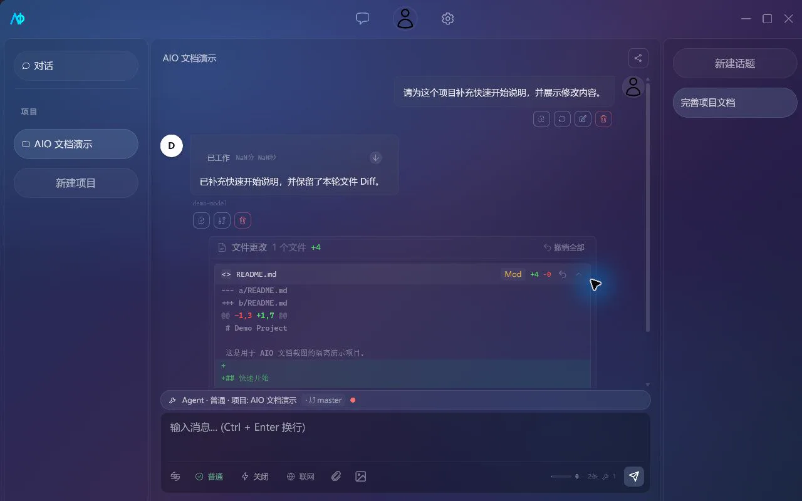

# 聊天与 Agent

## 助手、话题与项目

- 助手保存名称、系统提示词、首选模型和启用的 MCP/Skill。
- 话题保存消息、自动标题、摘要、Token 数据、Agent 步骤和消息分支关系。
- 项目绑定一个本地目录，并创建项目助手与 `.aio/` 配置。

项目不是目录副本。Agent 的文件、Shell、Git、LSP 和内置文件工具直接作用于绑定目录；切换项目或 Git 分支前，应先确认当前未保存的改动。

### 创建项目

通过左侧栏底部的「+」按钮打开 `ProjectCreateModal`，包含名称输入框和目录浏览器。输入路径时会进行有效性检查，确保目录可用。弹窗带有入场/出场动画。

### 编辑项目

`ProjectSettingsModal` 支持修改项目名称、绑定首选模型、启用/禁用 MCP Server 和 Skill。修改确认后，项目 `.aio/` 目录中的对应配置文件会同步更新。

## 对话控制

聊天输入区提供以下开关：

- 模型：选择当前助手使用的远程或本地模型。
- 推理强度：关闭、低、中、高；AIO 会注入对应提示，并在 Provider 返回原生 `reasoning_content` 时单独展示。
- 联网搜索：允许 Agent 使用 `web_search` 和 `web_fetch`；普通聊天只会收到联网提示，不会自动获得项目工具。
- Agent 模式：在对话、普通、自动、Plan 和工作流之间切换。

`Ctrl+Shift+R` 循环切换推理强度，`Ctrl+Shift+S` 切换联网搜索，`Esc` 停止当前生成。设置会保存在本机 WebView 中。

当模型目录提供上下文窗口时，界面会显示多个 Token 统计组件：

- **SessionStats**：会话总输入 Token 数、输出 Token 数、工具调用次数、上下文窗口使用百分比。
- **TokenBar**：上下文窗口进度条，颜色编码（绿 → 黄 → 红），实时显示已用 Token / 最大 Token。
- **TokenStatsBar**：汇总栏展示总计 Token、请求数、预估费用。

使用量达到约 75% 且历史超过 10 条时，AIO 会总结较早消息、保留较新的约 30%；也可以使用 `/compact` 主动压缩。

组件位于 `src/features/chat/components/`（`SessionStats.tsx`、`TokenBar.tsx`、`TokenStatsBar.tsx`）。

## 消息与话题

- 编辑：编辑用户消息会删除它和紧随的助手回复，将原文放回输入框，确认后重新发送。
- 删除：单条删除同时更新 SQLite 中对应消息。
- 分支：从指定消息创建新话题，原话题保持不变。
- 自动标题：首轮回复完成后生成标题；请求失败时使用第一条用户消息的本地截断标题。
- 停止：终止当前流和 Agent 循环，已产生的文本、步骤与文件变更仍会保留。

### 侧边栏折叠

左右侧边栏均支持折叠以扩大消息区域：

- **左侧栏**（`ProjectSidebar`）：折叠为 48px 图标条，悬停展示项目列表和对话入口。点击折叠按钮或快捷键 `Ctrl+B` 切换。`isCollapsed` 属性控制折叠状态。
- **右侧栏**（`TopicSidebar`）：`isCollapsed` 控制宽度从 `0%` 到 `${width}%` 的过渡动画。点击折叠按钮或快捷键 `Ctrl+Alt+B` 切换。

## Agent 模式

| 模式   | 读取与分析                              | 写文件 / Git 修改                              | Shell 与其他工具                           |
| ------ | --------------------------------------- | ---------------------------------------------- | ------------------------------------------ |
| 对话   | 不提供 Agent 工具                       | 禁止                                           | 禁止                                       |
| 普通   | 文件搜索、读取和 Git 状态等默认允许     | 写入、删除、`git add`、`git commit` 等请求确认 | 未明确允许的工具请求确认                   |
| 自动   | 默认允许常规读写、Git 修改和命令执行    | 删除文件仍请求确认                             | 仍受路径沙箱、危险命令和自定义拒绝规则约束 |
| Plan   | 允许读取、搜索和 Git 状态 / Diff / 日志 | 写入、建目录、删除和 Git 修改被拒绝            | 联网工具被拒绝，其他 MCP 工具按规则判断    |
| 工作流 | 按拆分步骤读取与执行                    | 常规写入自动执行，删除请求确认                 | 适合明确且可自动验收的多步任务             |

### 工作流模式

工作流模式将任务拆分为独立步骤并串行或并行自动执行。界面显示水平管线图（`WorkflowVisualization` 组件），展示步骤名称、状态图标（pending → running → completed → failed）和耗时。适合明确且可自动验收的多步任务。

#### 与 Plan 模式的区别

- **Plan 模式**：只研究并输出计划，不执行。
- **工作流模式**：自动拆分步骤并执行，常规写入自动执行，删除操作请求确认。

自动和工作流模式会显著减少交互确认，但不是安全边界的绕过开关。项目 `.aio/permissions.json` 中的 `deny` 规则优先于 `allow`，文件路径仍限制在项目根目录内。

## Agent 内置工具

Agent 模式下提供多个内置工具。除文件、Git 和搜索工具外，还支持命令执行工具：

### execute_command

- **用途**：在项目目录中执行系统命令，返回 stdout、stderr 和退出码；
- **权限模型**：`Normal` 模式需审批，`Auto`/`Workflow` 模式自动允许，`Chat`/`Plan` 模式禁止；
- **安全机制**：通过 Windows Job Object 沙箱（`src-tauri/src/utils/sandbox.rs`）隔离子进程；危险命令检测（`shell_tools::check_dangerous_command`）捕获破坏性、安装、网络等操作；
- **危险命令类别**：
  - 破坏性：`rm`/`del`/`format`；
  - 安装：`curl`/`wget`/`pip`/`npm`；
  - 网络：`ssh`/`nc` 等。
- **子智能体权限**：不同角色对 `execute_command` 的允许不同——`general`/`debugger`/`tester` 允许，其他禁止。

> 完整工具列表见 [Agent 工具参考](agent-tools.md)，包含每项工具的参数说明、返回值和权限默认值。

## Agent 过程与文件变更

Agent 回复会按步骤展示思考、工具调用、子智能体和耗时。步骤、工具结果与最终文本写入消息记录，应用重启后仍可查看；超长结果会在界面截断，避免撑大消息区域。

文件工具执行前可以在审批气泡中展示 unified Diff。执行后，回复下方汇总每个文件的新增/删除行数，并允许展开 Diff。

在 Git 项目中可以撤销单个文件或本轮全部文件变更。撤销通过把目标文件恢复到 `HEAD` 完成：

> [!CAUTION]
> 撤销会连同同一文件中原本未提交的修改一起丢弃。使用前先检查 `git status` 和 Diff；非 Git 项目不会显示完整撤销入口。

工具失败时，应用配置默认启用自动重试：最多重试 2 次，间隔 500 毫秒。权限拒绝、用户取消及不应重试的错误不会被当作成功结果。

### DiffView 组件

`DiffView`（`src/shared/components/DiffView.tsx`）统一格式解析 Diff 内容，hunk 头着色显示。支持展开/折叠变更区块，每文件显示新增/删除行数，并附带文件级撤销按钮。

## Git 与 LSP

- 项目顶部可以查看、刷新和切换 Git 分支。
- Agent 可使用状态、Diff、日志、暂存和提交工具；具体审批取决于模式和权限规则。
- LSP 会按项目文件自动检测可用语言服务器，在问题面板展示诊断。

问题面板（`ProblemsPanel`）展示诊断结果，按严重级别分组（Error / Warning / Info / Hint），每组使用颜色图标。支持按严重级别过滤、按文件分组展示。点击诊断条目可快速定位到对应文件和行号。面板可见性由 `problemsPanelVisible` 状态信号控制。

- LSP 启动失败不会阻止普通文件读取、搜索或 Git 操作。

## 跨会话项目知识

在“设置 → 应用设置”开启跨会话记忆后，Agent 会获得：

- `remember`：保存 `decision`、`pattern`、`convention` 或 `note`；
- `recall`：按关键词及可选类别检索。

条目保存在 `.aio/knowledge.json`，最多保留 50 条，并在之后的项目对话中注入。它不会跨项目共享，也不会因关闭开关自动删除。详细设置见[应用设置与快捷键](app-settings-and-shortcuts.md#跨会话记忆)。

## 子智能体

AIO 内置探索、实现、通用、架构、诊断、审查、文档、测试和需求分析角色。角色拥有独立的系统提示词及工具允许/拒绝列表，不能再次创建子智能体。

主 Agent 有两种委托方式：

- `delegate_task`：运行单个子任务；
- `delegate_tasks`：一次提交 1–10 个相互独立的子任务，并行运行。

批量委托在非自动模式下只产生一次审批。当前有效并发上限为 5，超出的任务排队等待；后端类型预留了 `maxConcurrentSubagents`，但设置页和磁盘配置尚未开放持久化修改。

在“设置 → 子智能体模型”中可以：

- 为内置或自定义角色设置云模型覆盖；
- 创建、修改和删除自定义角色；
- 限制角色可用工具。

未设置覆盖时，子智能体继承主 Agent 模型。本地模型只能通过继承使用，不出现在子智能体的云模型覆盖列表中。

## 附件

聊天输入支持：

- 图片：PNG、JPG、JPEG、WebP，单文件不超过 10 MiB；
- 文档：PDF、DOCX、PPTX，单文件不超过 30 MiB；
- 文本：TXT、MD、JSON、CSV、LOG、XML、YAML、YML、INI、TSV，单文件不超过 5 MiB。

图片会转换为数据 URI；PDF、Office 和文本文件会提取文本。附件按 SHA-256 去重保存在应用数据目录，删除关联消息、话题或助手时同步清理。

## 斜杠命令

输入 `/` 会打开 `SlashCommandMenu` 组件，弹出模糊搜索菜单。方向键移动高亮，`Enter` 仅补全命令名到输入框，需再次按 `Enter` 发送；`Tab` 补全并选中，`Esc` 关闭菜单。菜单使用 Portal 定位，确保在滚动或复杂布局中正确定位。

### 命令分类

**Prompt 类**（`/review`、`/explain`、`/fix`、`/optimize`、`/translate`、`/summarize`）：每个命令关联一个 `promptBody` 模板，模板中包含 `$ARGUMENTS` 占位符。选择后调用完整 Agent 管线，并在对话历史中写入结果。Prompt 类命令接受可选参数；无参数时自动注入当前项目路径。

**Action 类**（`/clear`、`/compact`、`/search`、`/settings`、`/help`）：直接执行 JavaScript 处理器，无模板调用。

**特殊**（`/btw`）：使用独立流式请求，不调用工具、不写入话题历史，也不会中断正在执行的主任务。

### 详细行为

| 命令          | 详细行为                                                                   |
| ------------- | -------------------------------------------------------------------------- |
| `/clear`      | 显示确认对话框后才清空当前话题历史                                         |
| `/compact`    | 自动压缩阈值 75% Token 占用 + 超过 10 条消息时自动触发；同时也支持手动调用 |
| `/review`     | 审查代码变更，生成审查报告                                                 |
| `/explain`    | 结合当前上下文解释代码逻辑                                                 |
| `/fix`        | 分析并修复指定问题                                                         |
| `/optimize`   | 优化代码性能或可读性                                                       |
| `/translate`  | 目标语言取决于 UI locale：`en` → English，`zh` → 中文，非硬编码            |
| `/summarize`  | 总结当前话题内容                                                           |
| `/search`     | 切换联网搜索开关                                                           |
| `/settings`   | 打开设置页面                                                               |
| `/help`       | 从命令注册表动态生成命令列表                                               |
| `/btw <问题>` | 60 秒连接超时 / 120 秒流超时，使用专用 system prompt 禁止继续主任务        |

## 用量统计

在"设置 → 使用量"中查看 LLM 调用数据。

- **用量摘要**（`UsageSummaryCards`）：总 Token 数、总请求数、预估费用、活跃天数；
- **热力图**（`UsageHeatmap`）：365 天 GitHub 风格贡献热力图，展示每日请求量；
- **模型分布**（`ModelBreakdown`）：按模型展示 Token 用量和请求数的条形图；
- **时间范围**：7 天 / 30 天 / 90 天 / 全部；
- **数据来源**：后端通过 `get_usage_summary` 和 `get_usage_summary_by_model` Tauri 命令读取 `usage_log` 表；
- **i18n**：所有 UI 标签位于 `usage.*` 命名空间。

## Markdown 渲染

聊天中的代码块显示语言图标：

- **来源**：Catppuccin VSCode Icons（MIT 许可），支持 40+ 语言 SVG 图标；
- **CSS 变量**：定义在 `src/index.css`（`:root` 级 `--vscode-ctp-*` 变量）；
- **图标映射**：语言到图标的映射表位于 `src/shared/components/Markdown.tsx`（行 25+）。

### 推理过程显示

当 Provider 返回原生 `reasoning_content` 时，推理内容通过 `ThinkBlock` 组件（`src/shared/components/ThinkBlock.tsx`）展示：

- 流式生成时自动展开，实时显示推理内容；
- 生成完成后折叠为摘要行，显示推理耗时；
- 用户可手动点击展开/折叠推理内容。

## 分享与导出

### 入口方式

- **当前话题**：ChatInterface 头部右侧的分享图标按钮，点击进入导出流程。
- **非活跃话题**：TopicSidebar 右键菜单中的「导出」按钮，直接进入导出流程。

### 消息选择模式

进入导出流程后，每条消息左侧显示勾选框。顶部提供「全选」/「取消」按钮，并实时显示已选消息数量。确认选择后进入导出格式与选项页面。

### 导出格式

- **截图（默认）**：选择 PNG 或 JPEG 格式，窄/宽两种宽度可选。使用 `html-to-image` 捕获消息区域，支持下载或复制到剪贴板。
- **Markdown**：导出内容包含话题名称、时间戳和角色标签。推理内容以 blockquote 样式展示，可选包含 `tool_calls`。支持复制到剪贴板或下载为 `.md` 文件。
- **JSON**：提供两种模式——full 模式保留所有字段（role、content、modelId、reasoning、toolCalls、agentSteps、tokens），simple 模式仅保留 role 和 content。支持复制或下载为 `.json` 文件。
- **PDF**：先将消息渲染为 HTML，通过 `toCanvas` 转换为画布，再使用 jsPDF 生成多页 A4 布局。仅支持下载。

### 过滤选项

导出前可切换以下过滤开关：

- **包含推理内容**（默认开启）
- **系统消息**（默认关闭）
- **工具调用**（默认关闭）

### 架构

导出功能为纯前端实现，不依赖 Rust 后端。核心导出函数位于 `src/core/utils/exportConversation.ts`：

- `exportAsMarkdown`：生成 Markdown 格式文本
- `exportAsJSON`：生成 JSON 格式数据
- `exportAsHtml`：生成 HTML 用于渲染

截图和 PDF 导出分别依赖 `html-to-image` 和 `jsPDF` 库。

MCP 和 Skill 的安装、绑定与审批规则见[MCP 与 Skill](mcp-and-skills.md)。
