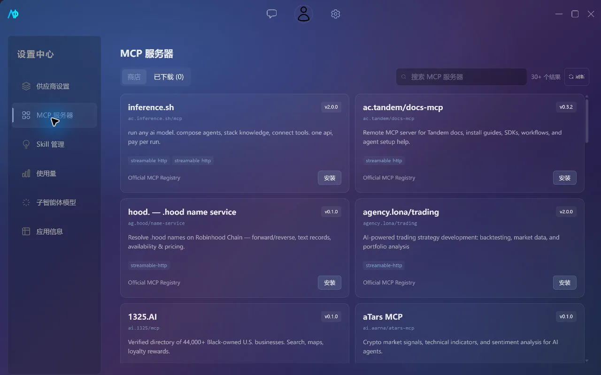

# MCP 与 Skill

## 两类扩展

- MCP Server 向模型提供 Tools、Resources 和 Prompts。
- Skill 向助手注入可复用的指令、说明和工作流程。

两者都支持全局和项目范围。项目配置位于绑定目录的 `.aio/` 中，切换项目时重新加载；下载或安装并不代表已经绑定到当前助手。



## MCP Server

AIO 当前注册三种传输：

| 传输            | 适用场景                     | 配置                           |
| --------------- | ---------------------------- | ------------------------------ |
| stdio           | 本机通过子进程运行的 Server  | 命令、参数、工作目录、环境变量 |
| HTTP            | HTTP + SSE 风格的远程 Server | URL、请求头                    |
| Streamable HTTP | MCP Streamable HTTP Server   | URL、请求头                    |

设置页支持查看、启停、测试、删除和编辑服务器。连接完成后会读取 capabilities，并按服务器声明列出 Tools、Resources 和 Prompts；聊天只向模型暴露当前助手或项目绑定且位于 `enabledTools` 白名单内的工具。空白名单表示全部启用。

新建项目时会自动写入隐藏的 `__aio-filesystem__` 配置。当前实现以内置文件工具执行它的工具名，不依赖外部 MCP 子进程，但仍受项目根目录与权限规则限制。

## stdio 配置示例

以下结构展示 `mcp-servers.json` 中的非敏感字段：

```json
[
  {
    "id": "demo-stdio",
    "displayName": "Demo stdio",
    "transport": {
      "transport": "stdio",
      "command": "npx",
      "args": ["-y", "@example/demo-mcp"],
      "env": {
        "DEMO_TOKEN": "${KEYRING:mcp-server-demo-stdio-env-DEMO_TOKEN}"
      },
      "cwd": null
    },
    "enabledTools": [],
    "autoStart": true,
    "hasStoredSecret": true
  }
]
```

Windows 会解析 `npx`、`npm`、`pnpm` 等命令对应的 `.cmd` 文件。进程通过参数数组启动，不执行拼接后的 Shell 字符串。

`${KEYRING:...}` 由设置页保存密钥时生成。不要手工创建占位符，也不要把真实 Token 直接写入 `env`。

## HTTP 配置示例

```json
[
  {
    "id": "demo-http",
    "displayName": "Demo HTTP",
    "transport": {
      "transport": "http",
      "url": "https://mcp.example.com/sse",
      "headers": {
        "Authorization": "Bearer ${KEYRING:mcp-server-demo-http-header-Authorization}"
      }
    },
    "enabledTools": ["search"],
    "autoStart": false,
    "hasStoredSecret": true
  }
]
```

Streamable HTTP 使用相同的 URL 与 headers 表单，应优先通过 Catalog 或设置界面创建，避免手工写错传输标识。远程地址会经过 URL 与 SSRF 检查。

## MCP Catalog

Catalog 页面读取官方 MCP Registry：

1. 检查服务器要求的 `npx`、`uvx` 等运行时；
2. 在 npm、PyPI、HTTP 或 Streamable HTTP 交付方式中选择可用项；
3. 收集必填参数和密钥；
4. 将密钥写入系统凭据库，将占位符写入配置；
5. 保存到当前全局或项目范围，并默认自动启动。

目录结果缓存在 `mcp-registry-cache.json`。安装第三方 Server 前，应检查发布者、实际命令、环境变量和可访问范围。

## 工具权限与审批

权限决策综合：

- Agent 模式；
- 工具名称和 MCP Server ID；
- 调用参数中的路径；
- 项目 `.aio/permissions.json` 自定义规则。

结果为 `allow`、`ask` 或 `deny`。需要确认的调用会生成审批请求；文件修改工具可以在执行前显示 Diff。自动模式仍会询问删除文件，并受路径沙箱、危险命令检查和明确拒绝规则约束。

示例：普通模式允许修改 `docs/**`，但拒绝所有删除工具：

```json
{
  "version": 1,
  "updatedAt": "2026-07-26T00:00:00",
  "rules": [
    {
      "id": "allow-doc-writes",
      "toolPattern": "write_file",
      "modes": ["normal"],
      "action": "allow",
      "pathPattern": "docs/*",
      "priority": 20
    },
    {
      "id": "deny-delete",
      "toolPattern": "delete_*",
      "modes": [],
      "action": "deny",
      "priority": 100
    }
  ]
}
```

字段含义：

| 字段          | 行为                                           |
| ------------- | ---------------------------------------------- |
| `id`          | 规则唯一标识                                   |
| `toolPattern` | 工具名、前缀/后缀 `*` 或 `*`                   |
| `serverId`    | 可选；只匹配指定 MCP Server                    |
| `modes`       | 空数组匹配全部模式                             |
| `action`      | `allow`、`ask` 或 `deny`                       |
| `pathPattern` | 可选；匹配工具参数中的 `path`                  |
| `priority`    | 数值越大越优先；匹配到的拒绝规则优先于允许规则 |

当前 glob 只支持完整匹配以及开头或结尾的单个 `*`，不要按完整 glob 语法理解。修改权限文件后应重新进入项目，让配置重新加载。

> 完整规则参考见[权限系统参考](../reference/permissions.md)，包含三层模型、评估顺序和内置默认规则。

## Resources 与 Prompts

连接成功的 Server 可以暴露：

- Resources：先列出 URI，再按需读取内容；
- Prompts：先列出模板，再传入参数获取消息。

是否可用取决于 Server 返回的 capabilities。未声明对应能力时，AIO 不发送多余请求，状态中的数量显示为零。

## Skill

“设置 → Skill 管理”提供：

- Skill 市场；
- 已下载的全局或项目 Skill；
- 从 NPX 包发现并导入的 Skill。

市场支持分类、热门和趋势浏览，并使用 6 小时缓存。项目 Skill 保存在 `.aio/skills.json`，全局 Skill 保存在应用数据目录。下载或导入后，还要在对应助手或项目设置中启用，内容才会注入对话。

## 项目文件

```text
project/
└── .aio/
    ├── mcp-servers.json
    ├── permissions.json
    ├── skills.json
    └── knowledge.json
```

`knowledge.json` 属于旧版跨会话记忆，首次打开项目记忆（RAG）时已自动迁移，仅存量项目可能保留该文件；`permissions.json` 只在存在自定义规则时需要。提交 `.aio/` 前检查环境相关路径和业务信息；密钥必须保留为凭据库占位符。

故障处理见[MCP 与 Skill 排查](../troubleshooting.md#mcp-server-无法启动)。
